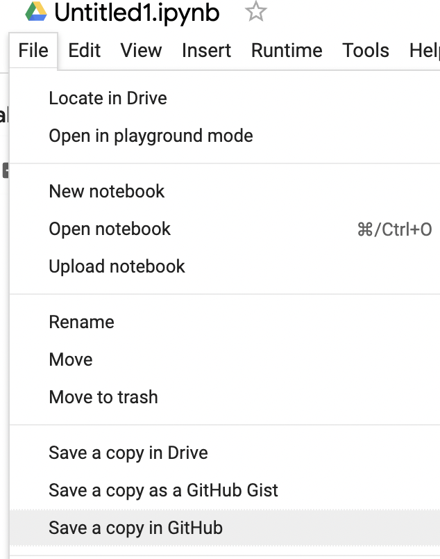

# ids706-week9-notebook

Week 9: Cloud-Hosted Notebook Data Manipulation

### Requirements
- Set up a cloud-hosted Jupyter Notebook (e.g., Google Colab)
- Perform data manipulation tasks on a sample dataset
### Grading Criteria
- Setup and configuration (20 points)
- Data manipulation tasks (20 points)
### Deliverables
- Link to the cloud-hosted notebook
- Document or video demonstrating the tasks performed


#### **1. Setup and Configuration**

Using Google Colab:

- Navigate to [Google Colab](https://colab.research.google.com/).
- Choose `File` -> `New notebook`.
- A new Jupyter Notebook will be launched in your browser, leveraging Google's cloud infrastructure.

#### **2. Data Manipulation Tasks**

For the purposes of this demonstration, we'll assume a simple CSV dataset. Below is an outline of the data manipulation tasks performed:

**2.1 Import Necessary Libraries**

```python
import pandas as pd
```

**2.2 Create a Simple Dataset**

```python
data = {
    'Name': ['Alice', 'Bob', 'Charlie', 'David'],
    'Age': [25, 30, 35, 40],
    'Salary': [50000, 60000, 70000, 80000]
}

df = pd.DataFrame(data)
```

**2.3 Display the Dataset**

```python
print(df)
```

**2.4 Filter Employees Older Than 30**

```python
print(df[df['Age'] > 30])
```

**2.5 Calculate the Average Salary**

```python
print(df['Salary'].mean())
```

**2.6 Add a New Employee**

```python
new_employee = pd.DataFrame({'Name': ['Eva'], 'Age': [28], 'Salary': [55000]})
df = pd.concat([df, new_employee], ignore_index=True)
print(df)
```

#### **3. Deliverables**

- Link to the cloud-hosted notebook: [https://colab.research.google.com/github/casnz1601/ids706-week9-notebook/blob/main/data-manipulation.ipynb]
- This `README.md` file demonstrates the tasks performed.


#### **4. Save in GitHub**
